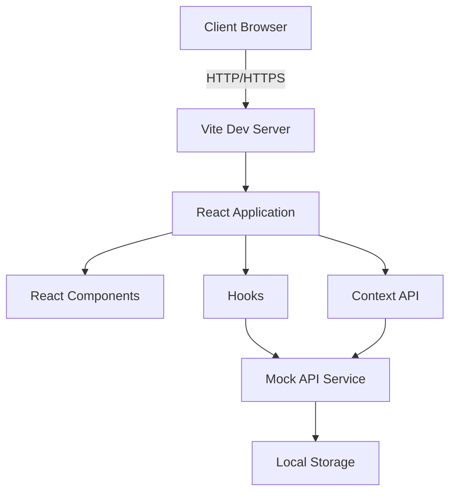

# DoD Fitness App - Technical Specifications

## Architecture Overview

The DoD Fitness App is built as a single-page application (SPA) using React for the frontend. The backend is simulated for this project but is designed to be easily replaced with a real backend implementation.



## Frontend Technologies

- **React**: A JavaScript library for building user interfaces
- **TypeScript**: A typed superset of JavaScript that compiles to plain JavaScript
- **Vite**: A build tool that aims to provide a faster and leaner development experience for modern web projects
- **Material-UI**: A popular React UI framework implementing Google's Material Design
- **React Router**: Declarative routing for React applications
- **Axios**: Promise-based HTTP client for making API requests
- **date-fns**: Modern JavaScript date utility library
- **react-confetti**: A lightweight confetti animation for React apps

## State Management

The application uses React's built-in state management solutions:

- **useState**: For component-level state
- **useContext**: For sharing state across multiple components
- **useReducer**: For more complex state logic (when necessary)

## Folder Structure

```
src/
├── api/
│   ├── index.ts
│   ├── types.ts
│   └── DefaultApi.ts
├── components/
│   ├── Footer.tsx
│   ├── Header.tsx
│   ├── MobileMenu.tsx
│   ├── WorkoutCalendar.tsx
│   ├── WorkoutDashboard.tsx
│   ├── WorkoutDayDetails.tsx
│   └── WorkoutWizard.tsx
├── hooks/
│   └── useApi.ts
├── pages/
│   ├── Home.tsx
│   ├── Login.tsx
│   ├── NutritionPlan.tsx
│   ├── Profile.tsx
│   └── WorkoutPlan.tsx
├── services/
│   ├── mockApi.ts
│   ├── mockAuth.ts
│   ├── mockNutritionPlan.ts
│   ├── mockProfile.ts
│   ├── mockStorage.ts
│   └── mockWorkoutPlan.ts
├── utils/
│   └── workoutUtils.ts
├── App.tsx
└── main.tsx
```

## Key Components

1. **App.tsx**: The main application component that handles routing and authentication
2. **Header.tsx**: The top navigation bar component
3. **Footer.tsx**: The footer component with copyright information and links
4. **WorkoutPlan.tsx**: The main workout planning and tracking page
5. **NutritionPlan.tsx**: The nutrition planning and tracking page
6. **Profile.tsx**: User profile management page
7. **Login.tsx**: User authentication page

## API Integration

The application uses a mock API service (`src/services/mockApi.ts`) that simulates backend functionality. This service can be easily replaced with real API calls when a backend is implemented.

Key API endpoints (mocked):

- `/auth/login`: User authentication
- `/auth/refresh`: Token refresh
- `/profile`: Get and update user profile
- `/workout-plan`: Generate and retrieve workout plans
- `/nutrition-plan`: Generate and retrieve nutrition plans

## Responsive Design

The application is designed to be responsive and work well on various device sizes:

- Desktop: Full-featured interface with side-by-side layouts
- Tablet: Adapted layouts with some stacked elements
- Mobile: Fully stacked layouts with a mobile-friendly navigation menu

## Performance Considerations

- Lazy loading of route components for faster initial load times
- Memoization of expensive calculations using `useMemo` and `useCallback`
- Efficient rendering with React's virtual DOM
- Optimized bundle size through code splitting and tree shaking with Vite

## Security Considerations

- JWT-based authentication (simulated)
- Secure storage of tokens in memory (not in local storage)
- HTTPS enforcement (to be implemented in production)
- Input validation and sanitization (to be implemented)

## Testing Strategy

- Unit tests for individual components and utilities (to be implemented)
- Integration tests for page components (to be implemented)
- End-to-end tests for critical user flows (to be implemented)

## Deployment

The application is designed to be easily deployable to various hosting platforms. For this project, we're using Netlify for continuous deployment.

By adhering to these technical specifications, the DoD Fitness App aims to provide a robust, performant, and maintainable solution for military fitness tracking and planning.